# PyFixMsg Plus Component Architecture Diagrams
## Visual System Design and Component Relationships

**Document Version:** 1.0  
**Date:** July 26, 2025  
**Purpose:** Comprehensive architectural diagrams for PyFixMsg Plus system components  

---

## Overview

This document provides detailed architectural diagrams showing the relationships, data flow, and deployment patterns for PyFixMsg Plus components across all development phases.

## Table of Contents

1. [High-Level System Architecture](#high-level-system-architecture)
2. [Core Component Relationships](#core-component-relationships)
3. [Message Flow Diagrams](#message-flow-diagrams)
4. [Data Storage Architecture](#data-storage-architecture)
5. [Session State Management](#session-state-management)
6. [Network Layer Architecture](#network-layer-architecture)
7. [Deployment Architectures](#deployment-architectures)
8. [Phase Evolution Diagrams](#phase-evolution-diagrams)

---

## High-Level System Architecture

### Core System Overview

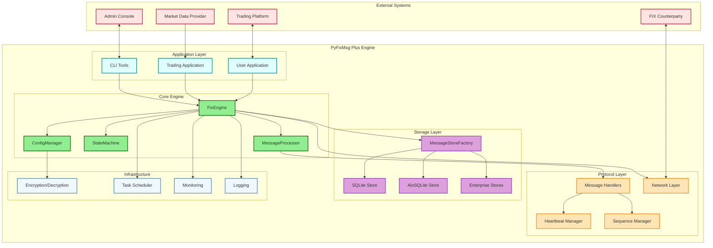

## Core Component Relationships

### FixEngine Internal Structure

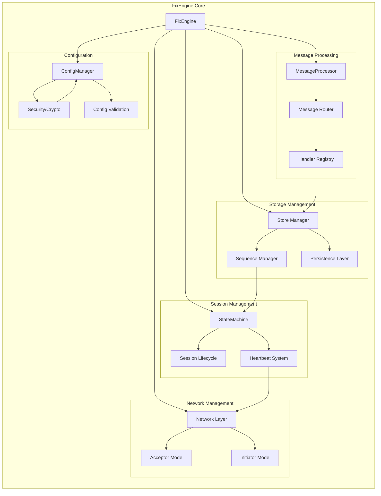

### Message Handler Architecture

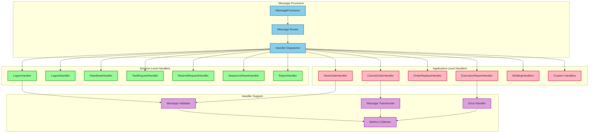

## Message Flow Diagrams

### Complete Message Processing Flow

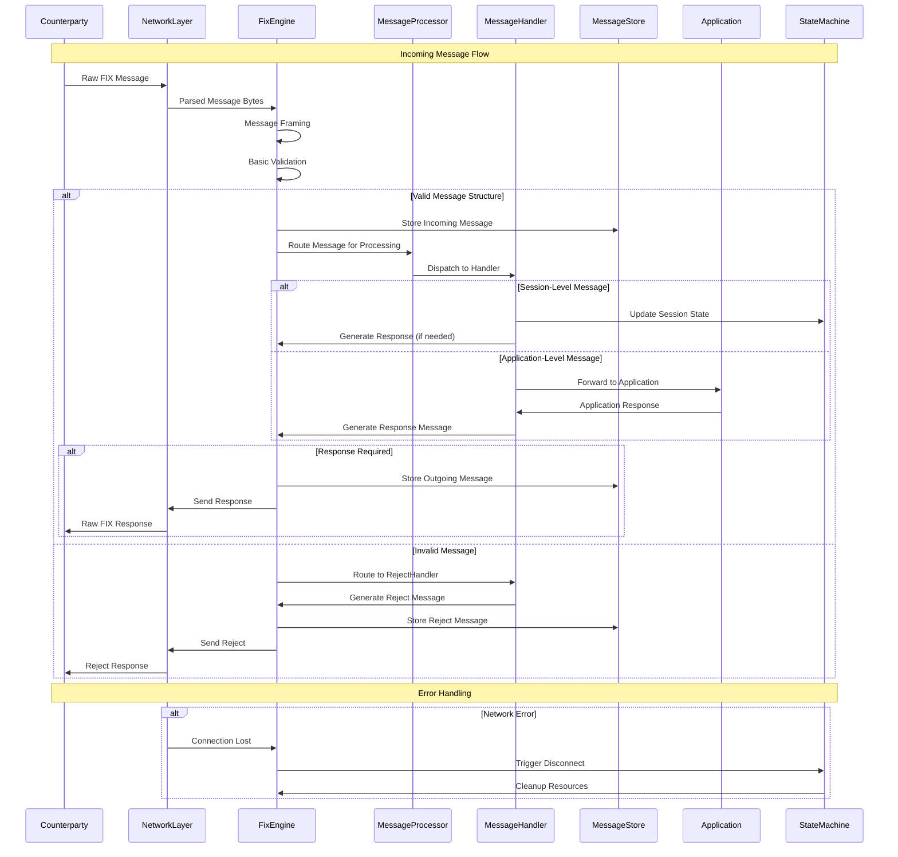

### Session Establishment Flow

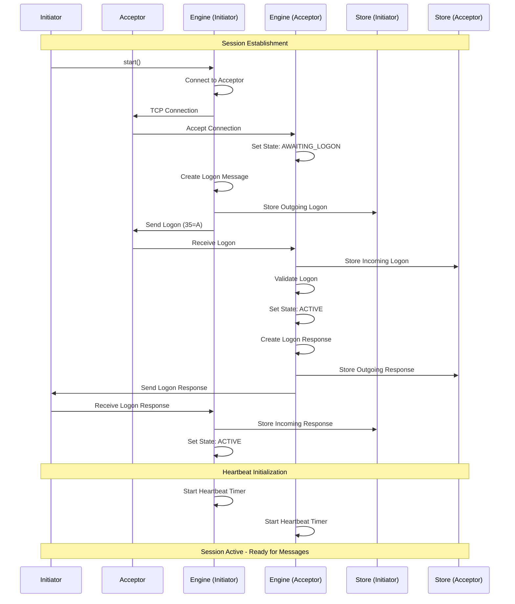

## Data Storage Architecture

### Message Store Interface Hierarchy

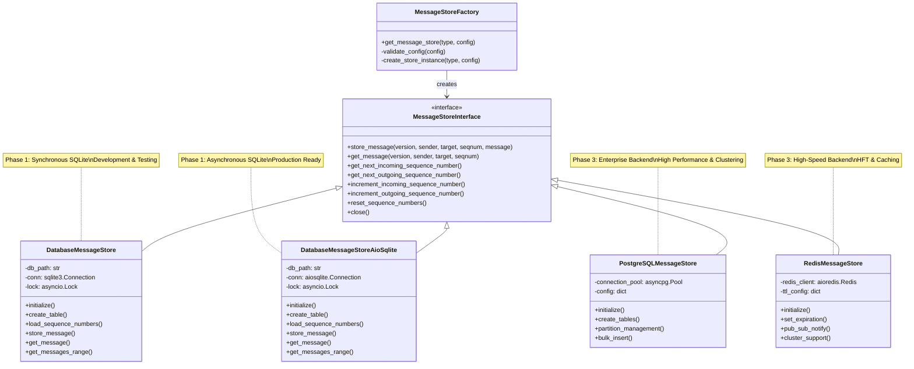

### Data Flow and Persistence Patterns

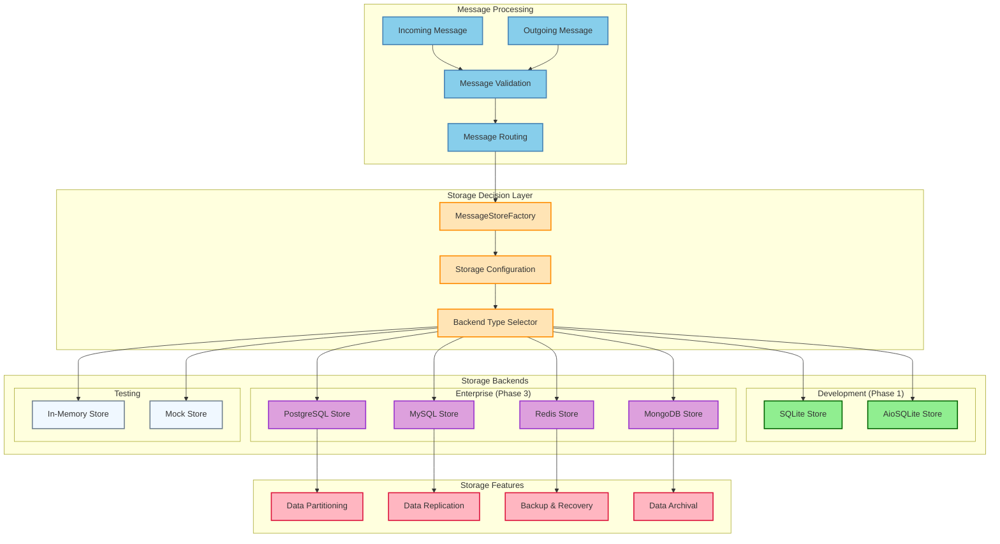

## Session State Management

### State Machine Detailed View

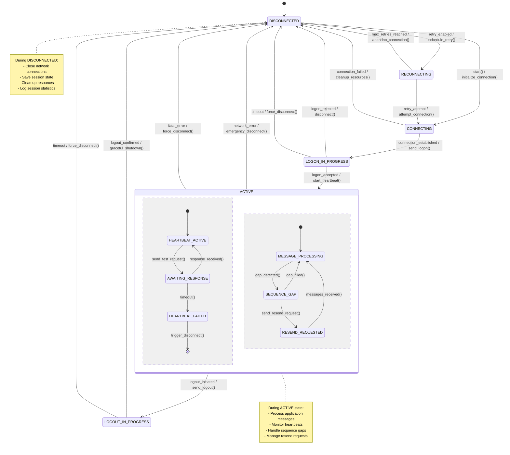

### State Transition Events and Actions

```mermaid
graph LR
    subgraph "External Events"
        USER_START[User: start()]
        NETWORK_CONNECT[Network: Connected]
        NETWORK_ERROR[Network: Error]
        MSG_RECEIVED[Message: Received]
        TIMEOUT_EVENT[Timer: Timeout]
        USER_STOP[User: stop()]
    end
    
    subgraph "State Machine"
        STATE_MGR[StateMachine]
        CURRENT_STATE[Current State]
        EVENT_PROCESSOR[Event Processor]
        TRANSITION_VALIDATOR[Transition Validator]
    end
    
    subgraph "Actions"
        NETWORK_ACTIONS[Network Actions]
        MESSAGE_ACTIONS[Message Actions]
        CLEANUP_ACTIONS[Cleanup Actions]
        LOGGING_ACTIONS[Logging Actions]
        CALLBACK_ACTIONS[Callback Actions]
    end
    
    subgraph "Side Effects"
        NOTIFY_APP[Notify Application]
        UPDATE_METRICS[Update Metrics]
        PERSIST_STATE[Persist State]
        SCHEDULE_TASKS[Schedule Tasks]
    end
    
    USER_START --> EVENT_PROCESSOR
    NETWORK_CONNECT --> EVENT_PROCESSOR
    NETWORK_ERROR --> EVENT_PROCESSOR
    MSG_RECEIVED --> EVENT_PROCESSOR
    TIMEOUT_EVENT --> EVENT_PROCESSOR
    USER_STOP --> EVENT_PROCESSOR
    
    EVENT_PROCESSOR --> TRANSITION_VALIDATOR
    TRANSITION_VALIDATOR --> CURRENT_STATE
    CURRENT_STATE --> STATE_MGR
    
    STATE_MGR --> NETWORK_ACTIONS
    STATE_MGR --> MESSAGE_ACTIONS
    STATE_MGR --> CLEANUP_ACTIONS
    STATE_MGR --> LOGGING_ACTIONS
    STATE_MGR --> CALLBACK_ACTIONS
    
    NETWORK_ACTIONS --> NOTIFY_APP
    MESSAGE_ACTIONS --> UPDATE_METRICS
    CLEANUP_ACTIONS --> PERSIST_STATE
    LOGGING_ACTIONS --> SCHEDULE_TASKS
    CALLBACK_ACTIONS --> NOTIFY_APP
    
    classDef events fill:#FFE4B5,stroke:#FF8C00,stroke-width:2px
    classDef statemachine fill:#87CEEB,stroke:#4682B4,stroke-width:2px
    classDef actions fill:#98FB98,stroke:#228B22,stroke-width:2px
    classDef sideeffects fill:#DDA0DD,stroke:#9932CC,stroke-width:2px
    
    class USER_START,NETWORK_CONNECT,NETWORK_ERROR,MSG_RECEIVED,TIMEOUT_EVENT,USER_STOP events
    class STATE_MGR,CURRENT_STATE,EVENT_PROCESSOR,TRANSITION_VALIDATOR statemachine
    class NETWORK_ACTIONS,MESSAGE_ACTIONS,CLEANUP_ACTIONS,LOGGING_ACTIONS,CALLBACK_ACTIONS actions
    class NOTIFY_APP,UPDATE_METRICS,PERSIST_STATE,SCHEDULE_TASKS sideeffects
```

## Network Layer Architecture

### Network Component Structure

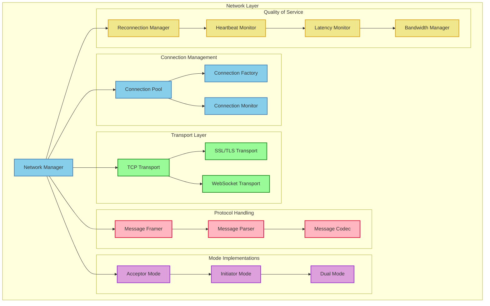

### Connection Lifecycle Management

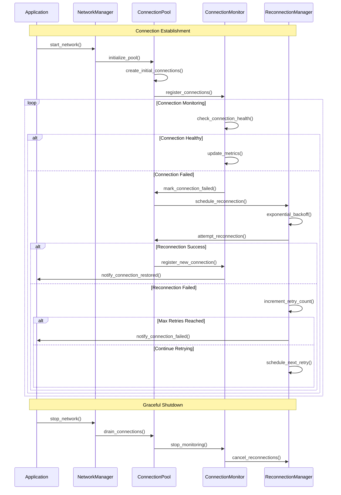

## Deployment Architectures

### Single Instance Deployment (Phase 1-2)

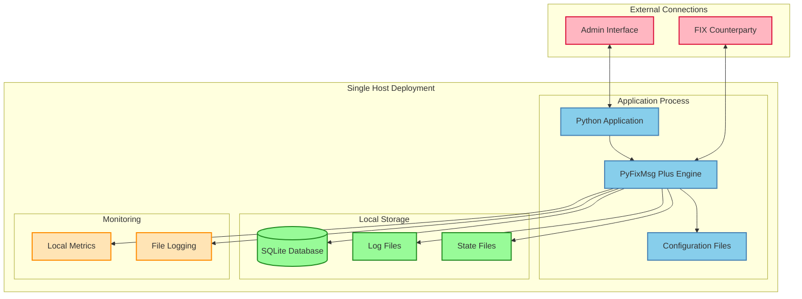

### High-Availability Deployment (Phase 3)

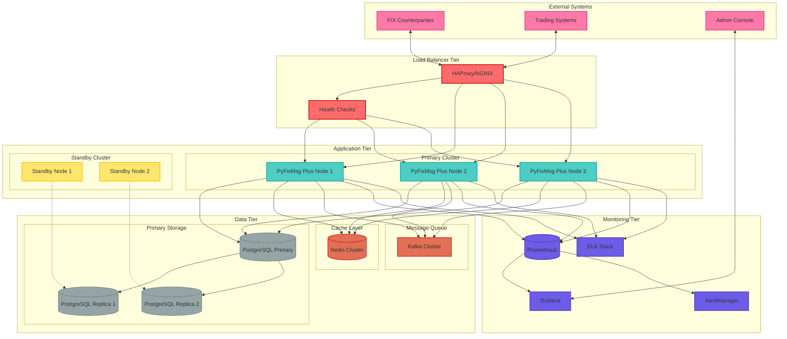

### Cloud-Native Deployment (Phase 4)

```mermaid
graph TB
    subgraph "Cloud Infrastructure"
        subgraph "Kubernetes Cluster"
            subgraph "Ingress Layer"
                INGRESS[Ingress Controller]
                SERVICE_MESH[Service Mesh (Istio)]
            end
            
            subgraph "Application Pods"
                POD1[PyFixMsg Plus Pod 1]
                POD2[PyFixMsg Plus Pod 2]
                POD3[PyFixMsg Plus Pod 3]
                HPA[Horizontal Pod Autoscaler]
            end
            
            subgraph "Supporting Services"
                CONFIG_SERVICE[Config Service]
                SECRET_MGR[Secret Manager]
                SERVICE_DISCOVERY[Service Discovery]
            end
            
            subgraph "Storage"
                PVC[Persistent Volume Claims]
                STORAGE_CLASS[Storage Classes]
            end
        end
        
        subgraph "Managed Services"
            CLOUD_DB[(Cloud Database)]
            CLOUD_CACHE[(Cloud Cache)]
            CLOUD_QUEUE[Cloud Message Queue]
            CLOUD_STORAGE[Cloud Object Storage]
        end
        
        subgraph "Monitoring & Observability"
            CLOUD_MONITORING[Cloud Monitoring]
            CLOUD_LOGGING[Cloud Logging]
            APM[Application Performance Monitoring]
            DISTRIBUTED_TRACING[Distributed Tracing]
        end
        
        subgraph "Security"
            IAM[Identity & Access Management]
            KMS[Key Management Service]
            NETWORK_POLICIES[Network Policies]
            SECURITY_SCANNING[Security Scanning]
        end
    end
    
    subgraph "External Integrations"
        CI_CD[CI/CD Pipeline]
        REGISTRY[Container Registry]
        HELM_CHARTS[Helm Charts]
        BACKUP_SERVICE[Backup Service]
    end
    
    INGRESS --> SERVICE_MESH
    SERVICE_MESH --> POD1
    SERVICE_MESH --> POD2
    SERVICE_MESH --> POD3
    
    HPA --> POD1
    HPA --> POD2
    HPA --> POD3
    
    POD1 --> CONFIG_SERVICE
    POD2 --> CONFIG_SERVICE
    POD3 --> CONFIG_SERVICE
    
    CONFIG_SERVICE --> SECRET_MGR
    SECRET_MGR --> KMS
    
    POD1 --> CLOUD_DB
    POD2 --> CLOUD_DB
    POD3 --> CLOUD_DB
    
    POD1 --> CLOUD_CACHE
    POD2 --> CLOUD_CACHE
    POD3 --> CLOUD_CACHE
    
    POD1 --> CLOUD_QUEUE
    POD2 --> CLOUD_QUEUE
    POD3 --> CLOUD_QUEUE
    
    PVC --> STORAGE_CLASS
    POD1 --> PVC
    POD2 --> PVC
    POD3 --> PVC
    
    POD1 --> CLOUD_MONITORING
    POD2 --> CLOUD_MONITORING
    POD3 --> CLOUD_MONITORING
    
    CLOUD_MONITORING --> APM
    CLOUD_LOGGING --> DISTRIBUTED_TRACING
    
    IAM --> POD1
    IAM --> POD2
    IAM --> POD3
    
    NETWORK_POLICIES --> SERVICE_MESH
    SECURITY_SCANNING --> POD1
    
    CI_CD --> REGISTRY
    REGISTRY --> POD1
    HELM_CHARTS --> CONFIG_SERVICE
    BACKUP_SERVICE --> CLOUD_STORAGE
    
    classDef ingress fill:#FF9999,stroke:#FF0000,stroke-width:2px
    classDef application fill:#99CCFF,stroke:#0066CC,stroke-width:2px
    classDef supporting fill:#99FF99,stroke:#00CC00,stroke-width:2px
    classDef storage fill:#FFCC99,stroke:#FF6600,stroke-width:2px
    classDef managed fill:#CC99FF,stroke:#6600CC,stroke-width:2px
    classDef monitoring fill:#FFFF99,stroke:#CCCC00,stroke-width:2px
    classDef security fill:#FF99CC,stroke:#CC0066,stroke-width:2px
    classDef external fill:#CCCCCC,stroke:#666666,stroke-width:2px
    
    class INGRESS,SERVICE_MESH ingress
    class POD1,POD2,POD3,HPA application
    class CONFIG_SERVICE,SECRET_MGR,SERVICE_DISCOVERY supporting
    class PVC,STORAGE_CLASS storage
    class CLOUD_DB,CLOUD_CACHE,CLOUD_QUEUE,CLOUD_STORAGE managed
    class CLOUD_MONITORING,CLOUD_LOGGING,APM,DISTRIBUTED_TRACING monitoring
    class IAM,KMS,NETWORK_POLICIES,SECURITY_SCANNING security
    class CI_CD,REGISTRY,HELM_CHARTS,BACKUP_SERVICE external
```

## Phase Evolution Diagrams

### Feature Evolution Across Phases

```mermaid
timeline
    title PyFixMsg Plus Feature Evolution
    
    section Phase 1 : Core Engine
        Foundation           : Core FIX Engine
                            : Session Management
                            : Basic Message Stores
                            : Configuration System
                            : CLI Tools
    
    section Phase 2 : Production Ready
        Quality              : Comprehensive Testing
                            : Performance Optimization
                            : QuickFIX Interoperability
                            : Complete Documentation
                            : CI/CD Pipeline
    
    section Phase 3 : Enterprise
        Scalability          : Multiple DB Backends
                            : High Availability
                            : Advanced Monitoring
                            : Security Hardening
                            : HFT Optimization
    
    section Phase 4 : Ecosystem
        Innovation           : FIX 5.0+ Support
                            : Cloud Deployment
                            : Trading Framework
                            : Market Data Platform
                            : Community Tools
```

### Architecture Complexity Evolution

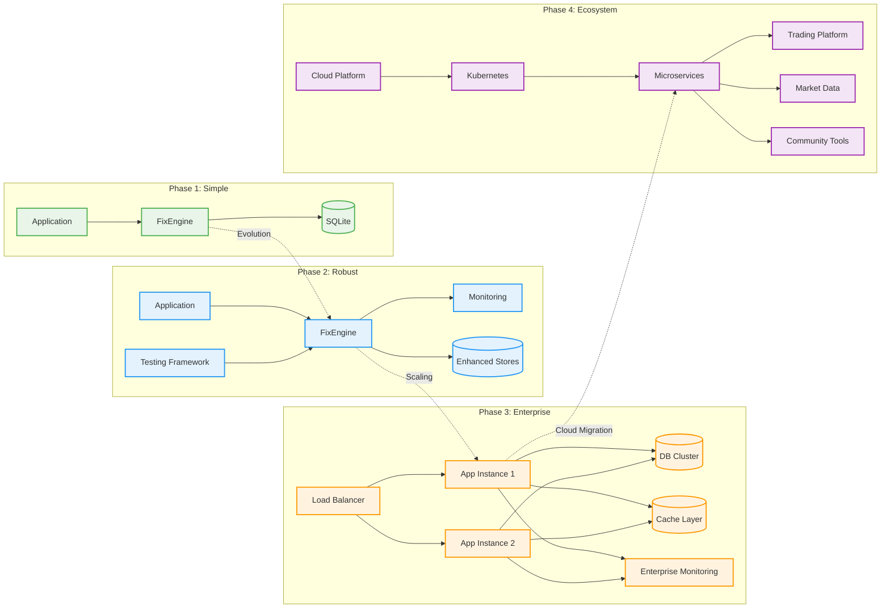

---

## Conclusion

These component diagrams provide a comprehensive visual representation of PyFixMsg Plus architecture across all phases of development. They illustrate:

1. **System Structure**: How components interact and depend on each other
2. **Data Flow**: How messages and data move through the system
3. **Evolution Path**: How the architecture grows from simple to enterprise-scale
4. **Deployment Options**: Various deployment patterns for different use cases
5. **Technology Integration**: How different technologies and frameworks integrate

The diagrams serve as both design documentation and implementation guidance, helping developers understand the system architecture and make informed decisions about component interactions and system evolution.

---

**Document Maintained By:** Architecture Team  
**Review Frequency:** Quarterly or upon major architectural changes  
**Related Documents:** Implementation Roadmap, Phase Implementation Plans  
**Version Control:** All diagrams are version-controlled and updated with code changes
