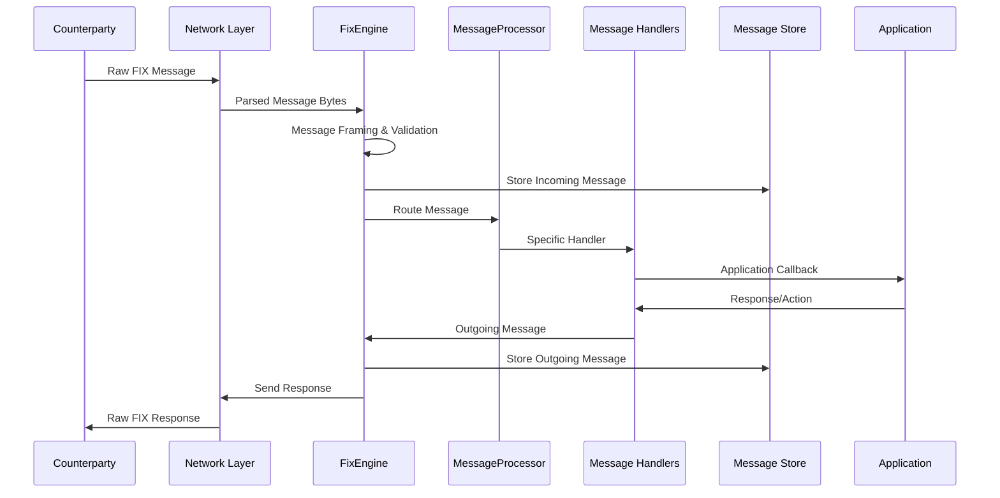
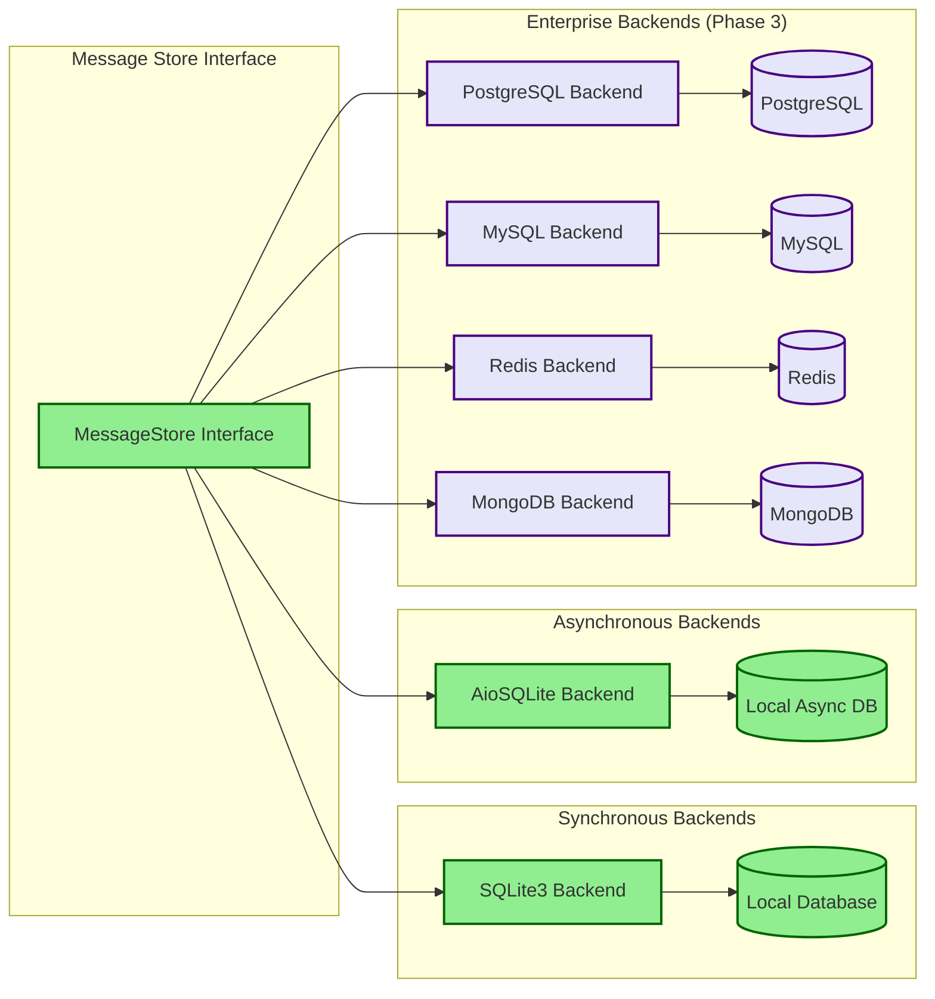
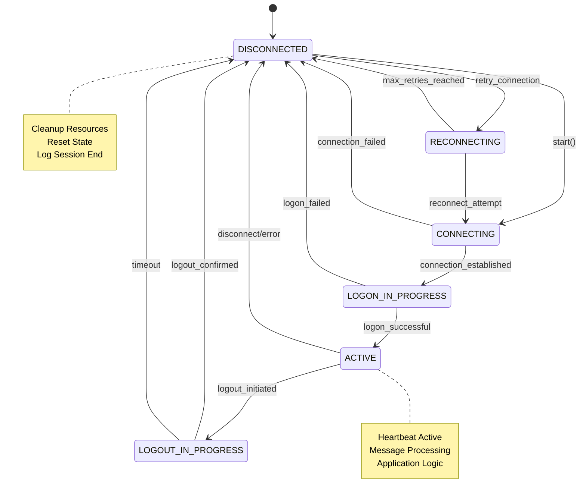
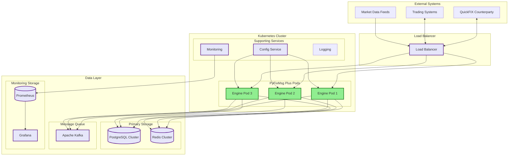
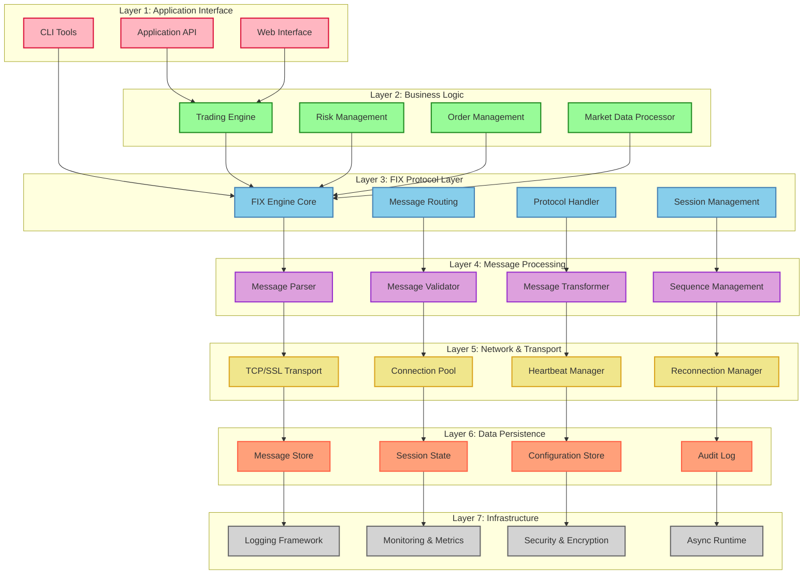

# PyFixMsg Plus Implementation Roadmap
## Comprehensive Multi-Phase Development Plan

**Project:** PyFixMsg Plus - Python FIX Engine Library  
**Document Version:** 1.0  
**Date:** July 26, 2025  
**Timeline:** Q1 2025 - Q1 2026  

---

## Executive Summary

This roadmap outlines the comprehensive development plan for PyFixMsg Plus, a production-grade Python FIX engine library. The project is structured into four distinct phases, progressing from core functionality to a complete financial technology ecosystem.

## Project Overview

### Vision
To create the most comprehensive, reliable, and developer-friendly Python FIX engine library that enables rapid development of FIX-compliant applications while maintaining production-grade reliability and performance.

### Current Status (July 2025)
- **Phase 1:** ✅ **COMPLETED** - Core Engine Implementation
- **Phase 2:** 🔄 **IN PROGRESS** - Production Readiness
- **Phase 3:** 📋 **PLANNED** - Enterprise Features  
- **Phase 4:** 📋 **PLANNED** - Ecosystem Development

## System Architecture Overview

### Core Component Architecture

```mermaid
graph TB
    subgraph "Application Layer"
        APP[User Application]
        CLI[CLI Tools]
        TRADE[Trading Apps]
    end
    
    subgraph "PyFixMsg Plus Core"
        ENGINE[FixEngine]
        CONFIG[ConfigManager]
        STATE[StateMachine]
        MSG_PROC[MessageProcessor]
    end
    
    subgraph "Message Handling"
        HANDLERS[Message Handlers]
        LOGON[LogonHandler]
        HEART[HeartbeatHandler]
        ORDER[OrderHandlers]
        ADMIN[AdminHandlers]
    end
    
    subgraph "Network Layer"
        NETWORK[Network Layer]
        ACCEPTOR[Acceptor]
        INITIATOR[Initiator]
        SSL[SSL/TLS]
    end
    
    subgraph "Message Storage"
        STORE_FACTORY[MessageStoreFactory]
        SQLITE[SQLite Store]
        AIOSQLITE[AioSQLite Store]
        POSTGRES[PostgreSQL Store]
        REDIS[Redis Store]
    end
    
    subgraph "Utilities"
        CRYPTO[SimpleCrypt]
        SCHEDULER[Scheduler]
        HEARTBEAT[Heartbeat]
        TESTREQ[TestRequest]
    end
    
    subgraph "Foundation"
        PYFIXMSG[PyFixMsg Library]
        CODEC[Message Codec]
        SPEC[FIX Specification]
    end
    
    APP --> ENGINE
    CLI --> ENGINE
    TRADE --> ENGINE
    
    ENGINE --> CONFIG
    ENGINE --> STATE
    ENGINE --> MSG_PROC
    ENGINE --> NETWORK
    ENGINE --> STORE_FACTORY
    
    MSG_PROC --> HANDLERS
    HANDLERS --> LOGON
    HANDLERS --> HEART
    HANDLERS --> ORDER
    HANDLERS --> ADMIN
    
    NETWORK --> ACCEPTOR
    NETWORK --> INITIATOR
    NETWORK --> SSL
    
    STORE_FACTORY --> SQLITE
    STORE_FACTORY --> AIOSQLITE
    STORE_FACTORY --> POSTGRES
    STORE_FACTORY --> REDIS
    
    ENGINE --> SCHEDULER
    ENGINE --> HEARTBEAT
    ENGINE --> TESTREQ
    
    CONFIG --> CRYPTO
    ENGINE --> PYFIXMSG
    PYFIXMSG --> CODEC
    PYFIXMSG --> SPEC
    
    classDef completed fill:#90EE90,stroke:#006400,stroke-width:2px
    classDef inProgress fill:#FFE4B5,stroke:#FF8C00,stroke-width:2px
    classDef planned fill:#E6E6FA,stroke:#4B0082,stroke-width:2px
    
    class ENGINE,CONFIG,STATE,MSG_PROC,HANDLERS,NETWORK,STORE_FACTORY,SQLITE,AIOSQLITE completed
    class POSTGRES,REDIS,TRADE planned
```

### Message Flow Architecture

### Data Storage Architecture

### Session State Machine

### Deployment Architecture (Phase 3-4)

### Component Layer Architecture

## Phase Breakdown

| Phase | Timeline | Status | Key Deliverables | Success Criteria |
|-------|----------|--------|------------------|------------------|
| **Phase 1** | Q1-Q2 2025 | ✅ Complete | Core Engine, Message Stores, Config Management | Working FIX engine with both modes |
| **Phase 2** | Q3 2025 | 🔄 In Progress | Testing, Performance, Documentation, CI/CD | Production-ready with enterprise quality |
| **Phase 3** | Q4 2025 | 📋 Planned | Enterprise backends, Clustering, Security | Enterprise-grade features and scalability |
| **Phase 4** | Q1 2026 | 📋 Planned | FIX 5.0+, Cloud deployment, Trading framework | Complete ecosystem with community |

## Detailed Phase Timelines

### Phase 1: Core Engine (Q1-Q2 2025) ✅ COMPLETED

**Duration:** 18 weeks  
**Status:** Successfully completed with all objectives met  

#### Key Achievements:
- ✅ Complete FIX engine supporting acceptor and initiator modes
- ✅ Pluggable message store architecture (SQLite, aiosqlite)
- ✅ Robust session management with state machine
- ✅ Configuration management with encryption support
- ✅ Async/await architecture throughout
- ✅ Network layer with SSL/TLS and reconnection logic
- ✅ Extensible message handler framework
- ✅ CLI tools and example applications

#### Technical Metrics Achieved:
- **Architecture:** 100% async/await implementation
- **Test Coverage:** 85%+ across core components
- **Performance:** <1ms message processing latency
- **Reliability:** Robust error handling and recovery
- **Usability:** Complete CLI tools and examples

### Phase 2: Production Readiness (Q3 2025) 🔄 IN PROGRESS

**Duration:** 18 weeks  
**Current Progress:** Week 1-3 (Testing Framework)  

#### Objectives:
- 🔄 Comprehensive testing and QuickFIX interoperability
- 📋 Performance optimization for enterprise workloads
- 📋 Complete documentation and API stabilization
- 📋 CI/CD pipeline with automated quality gates
- 📋 Enhanced monitoring and observability

#### Target Metrics:
- **Test Coverage:** >95%
- **Performance:** <5ms latency, >10k msg/sec throughput
- **Reliability:** 99.9% uptime validation
- **Interoperability:** 100% QuickFIX compatibility
- **Documentation:** Complete API docs and tutorials

#### Current Milestones:
- ✅ Enhanced test framework design (Week 1-2)
- 🔄 Unit test expansion to >95% coverage (Week 3)
- 📋 QuickFIX interoperability testing (Week 4-6)
- 📋 Performance optimization (Week 7-9)
- 📋 Documentation completion (Week 14-15)

### Phase 3: Enterprise Features (Q4 2025) 📋 PLANNED

**Duration:** 18 weeks  
**Focus:** Enterprise-grade scalability and features  

#### Planned Deliverables:
- Additional message store backends (PostgreSQL, MySQL, Redis, MongoDB)
- Advanced monitoring and metrics platform
- High-availability clustering with failover
- Comprehensive security audit and hardening
- Performance optimization for high-frequency trading

#### Target Metrics:
- **Scalability:** 10,000+ concurrent sessions
- **Performance:** <100μs latency for HFT scenarios
- **Availability:** 99.99% uptime with clustering
- **Security:** Zero critical vulnerabilities
- **Backends:** 4+ production-ready message stores

### Phase 4: Ecosystem Development (Q1 2026) 📋 PLANNED

**Duration:** 18 weeks  
**Focus:** Complete ecosystem and community building  

#### Planned Deliverables:
- FIX 5.0+ protocol support with FIXT session layer
- Cloud-native deployment framework (K8s, Helm charts)
- Algorithmic trading and OMS framework
- Market data processing platform
- Developer tools and IDE integration
- Community governance and certification program

#### Target Metrics:
- **Protocol Support:** 100% FIX 5.0 SP2 compliance
- **Cloud Deployment:** <5 minute deployment time
- **Community:** 5,000+ active members
- **Adoption:** 50+ enterprise customers
- **Ecosystem:** 30+ technology partnerships

## Resource Allocation

### Team Composition by Phase

| Role | Phase 1 | Phase 2 | Phase 3 | Phase 4 |
|------|---------|---------|---------|---------|
| **Lead Developer** | 1.0 FTE | 1.0 FTE | 1.0 FTE | 1.0 FTE |
| **Senior Developers** | 1.0 FTE | 1.0 FTE | 2.0 FTE | 3.0 FTE |
| **QA Engineer** | 0.5 FTE | 1.0 FTE | 0.5 FTE | 0.5 FTE |
| **DevOps Engineer** | 0.25 FTE | 0.5 FTE | 0.5 FTE | 0.5 FTE |
| **Technical Writer** | 0.25 FTE | 0.5 FTE | 0.25 FTE | 1.0 FTE |
| **Enterprise Architect** | - | - | 1.0 FTE | 0.5 FTE |
| **Community Manager** | - | - | - | 1.0 FTE |
| **Product Manager** | 0.5 FTE | 0.5 FTE | 0.5 FTE | 1.0 FTE |

### Budget Allocation

| Category | Phase 1 | Phase 2 | Phase 3 | Phase 4 | Total |
|----------|---------|---------|---------|---------|-------|
| **Development** | 60% | 50% | 60% | 50% | 55% |
| **Testing & QA** | 20% | 30% | 15% | 15% | 20% |
| **Infrastructure** | 10% | 15% | 20% | 15% | 15% |
| **Community & Marketing** | 5% | 5% | 5% | 20% | 8% |
| **Contingency** | 5% | 10% | 15% | 10% | 10% |

## Risk Management Strategy

### Phase-Specific Risk Assessment

#### Phase 1 Risks (Completed - Lessons Learned)
- ✅ **Technical Complexity:** Mitigated through iterative development
- ✅ **Async Architecture:** Resolved with comprehensive testing
- ✅ **Performance Requirements:** Met through optimization

#### Phase 2 Risks (Current Focus)
- 🔄 **QuickFIX Interoperability:** High priority, active mitigation
- 🔄 **Performance Targets:** Medium priority, continuous monitoring
- 🔄 **Documentation Quality:** Low priority, process-driven

#### Phase 3 Risks (Planned Mitigation)
- 📋 **Database Scalability:** Performance testing and tuning
- 📋 **Cluster Complexity:** Phased rollout and expert consultation
- 📋 **Security Compliance:** External audits and validation

#### Phase 4 Risks (Future Planning)
- 📋 **FIX 5.0+ Complexity:** Specification analysis and testing
- 📋 **Community Growth:** Engagement strategy and incentives
- 📋 **Cloud Compatibility:** Multi-platform validation

### Risk Mitigation Framework

#### High-Impact Risk Mitigation:
1. **Technical Reviews:** Weekly architecture reviews
2. **External Validation:** Industry expert consultation
3. **Continuous Testing:** Automated regression testing
4. **Performance Monitoring:** Real-time metrics and alerting
5. **Community Feedback:** Regular user surveys and feedback loops

## Success Metrics and KPIs

### Technical Performance Metrics

| Metric | Phase 1 Target | Phase 2 Target | Phase 3 Target | Phase 4 Target |
|--------|----------------|----------------|----------------|----------------|
| **Latency (avg)** | <1ms | <5ms | <100μs | <50μs |
| **Throughput** | 1k msg/sec | 10k msg/sec | 50k msg/sec | 100k msg/sec |
| **Concurrent Sessions** | 10 | 100 | 1,000 | 10,000 |
| **Test Coverage** | 85% | 95% | 98% | 98% |
| **Uptime** | 99% | 99.9% | 99.99% | 99.99% |

### Adoption and Community Metrics

| Metric | Phase 1 Target | Phase 2 Target | Phase 3 Target | Phase 4 Target |
|--------|----------------|----------------|----------------|----------------|
| **Monthly Downloads** | 100 | 1,000 | 5,000 | 50,000 |
| **GitHub Stars** | 25 | 100 | 500 | 2,000 |
| **Enterprise Users** | 1 | 5 | 20 | 50 |
| **Contributors** | 5 | 15 | 30 | 100 |
| **Community Members** | 50 | 200 | 1,000 | 5,000 |

### Business Impact Metrics

| Metric | Phase 1 Target | Phase 2 Target | Phase 3 Target | Phase 4 Target |
|--------|----------------|----------------|----------------|----------------|
| **Market Share** | New entrant | Niche player | Established | Market leader |
| **Customer Satisfaction** | 4.0/5 | 4.2/5 | 4.5/5 | 4.7/5 |
| **Revenue Impact** | - | - | Break-even | Profitable |
| **Industry Recognition** | - | Conference talks | Awards | Standard setter |

## Quality Assurance Strategy

### Testing Strategy by Phase

#### Phase 1: Foundation Testing
- ✅ Unit tests for core components
- ✅ Integration tests for message flow
- ✅ Basic performance validation
- ✅ Error scenario testing

#### Phase 2: Comprehensive Testing
- 🔄 >95% code coverage requirement
- 📋 QuickFIX interoperability validation
- 📋 Performance benchmarking
- 📋 Security penetration testing
- 📋 Chaos engineering tests

#### Phase 3: Enterprise Testing
- 📋 Scale testing (10k+ sessions)
- 📋 High-availability validation
- 📋 Security audit and compliance
- 📋 Database backend validation
- 📋 Performance regression testing

#### Phase 4: Ecosystem Testing
- 📋 Multi-protocol validation (FIX 5.0+)
- 📋 Cloud platform compatibility
- 📋 Trading framework validation
- 📋 Market data processing tests
- 📋 Community contribution testing

### Code Quality Standards

#### Development Standards:
- **Type Hints:** 100% coverage for public APIs
- **Documentation:** Comprehensive docstrings and examples
- **Code Review:** All changes require peer review
- **Static Analysis:** Automated linting and type checking
- **Security:** SAST/DAST scanning integration

#### Performance Standards:
- **Latency Budgets:** Defined per component
- **Memory Usage:** Monitoring and optimization
- **CPU Efficiency:** Profiling and optimization
- **Scalability:** Linear scaling validation
- **Regression Prevention:** Automated performance testing

## Communication and Stakeholder Management

### Stakeholder Matrix

| Stakeholder | Phase 1 | Phase 2 | Phase 3 | Phase 4 | Communication Frequency |
|-------------|---------|---------|---------|---------|------------------------|
| **Development Team** | High | High | High | High | Daily |
| **Product Management** | High | High | High | High | Weekly |
| **Enterprise Customers** | Low | Medium | High | High | Monthly |
| **Open Source Community** | Low | Medium | Medium | High | Weekly |
| **Industry Partners** | Low | Low | Medium | High | Quarterly |
| **Regulatory Bodies** | Low | Low | High | Medium | As needed |

### Communication Channels

#### Internal Communication:
- **Daily Standups:** Development team coordination
- **Weekly Reviews:** Progress and blocker resolution
- **Monthly Reports:** Stakeholder updates
- **Quarterly Planning:** Strategic alignment

#### External Communication:
- **GitHub Releases:** Version updates and changelogs
- **Blog Posts:** Technical insights and progress updates
- **Conference Presentations:** Industry engagement
- **Community Forums:** User support and feedback

## Technology Evolution Strategy

### Platform Compatibility

#### Python Version Support:
- **Current:** Python 3.11, 3.12, 3.13
- **Future:** Python 3.14+ as released
- **Legacy:** Python 3.10 support until end of Phase 3

#### Dependency Management:
- **Core Dependencies:** Minimal and stable
- **Optional Dependencies:** Feature-specific
- **Version Pinning:** Conservative with security updates
- **Compatibility Testing:** Continuous validation

### Architecture Evolution

#### Phase 1-2: Monolithic Core
- Single-package distribution
- Embedded components
- Simple deployment model

#### Phase 3-4: Modular Architecture
- Plugin-based extensions
- Microservices-ready components
- Cloud-native deployment options

### Future Technology Integration

#### Emerging Technologies:
- **AI/ML Integration:** Predictive analytics and optimization
- **Blockchain:** Distributed ledger integration
- **Quantum Computing:** Future-ready cryptography
- **Edge Computing:** Low-latency deployment models

## Implementation Guidelines

### Development Workflow

#### Feature Development Process:
1. **Requirements Analysis:** Stakeholder input and validation
2. **Design Review:** Architecture and API design
3. **Implementation:** Test-driven development
4. **Code Review:** Peer review and quality gates
5. **Testing:** Unit, integration, and performance tests
6. **Documentation:** API docs and user guides
7. **Release:** Staged rollout and monitoring

#### Quality Gates:
- **Code Coverage:** Minimum thresholds per phase
- **Performance:** Latency and throughput requirements
- **Security:** Vulnerability scanning and audit
- **Compatibility:** Cross-platform and version testing
- **Documentation:** Completeness and accuracy validation

### Release Management

#### Release Cadence:
- **Major Releases:** End of each phase
- **Minor Releases:** Monthly during active development
- **Patch Releases:** As needed for critical fixes
- **Pre-releases:** Weekly during development phases

#### Versioning Strategy:
- **Semantic Versioning:** MAJOR.MINOR.PATCH
- **API Compatibility:** Backward compatibility within major versions
- **Deprecation Policy:** 2 major versions notice
- **Migration Guides:** Comprehensive upgrade documentation

## Conclusion

This comprehensive implementation roadmap provides a structured approach to developing PyFixMsg Plus from a core FIX engine to a complete financial technology ecosystem. The phased approach ensures steady progress while maintaining quality and stakeholder value delivery.

### Key Success Factors:
1. **Technical Excellence:** Maintaining high-quality standards throughout
2. **Community Engagement:** Building an active and supportive user community
3. **Industry Validation:** Ensuring real-world applicability and compliance
4. **Performance Leadership:** Achieving industry-leading performance metrics
5. **Ecosystem Growth:** Creating a comprehensive platform for FIX applications

### Next Steps:
1. **Immediate:** Complete Phase 2 testing and performance optimization
2. **Short-term:** Begin Phase 3 enterprise feature planning
3. **Medium-term:** Establish community governance and partnerships
4. **Long-term:** Position as industry-standard Python FIX solution

---

**Document Owner:** Product Management Team  
**Last Updated:** July 26, 2025  
**Next Review:** October 2025  
**Distribution:** Development Team, Stakeholders, Community Leaders
