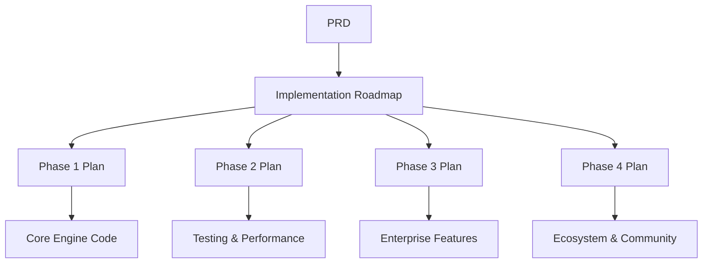

# PyFixMsg Plus Documentation Index
## Complete Documentation Library

**Last Updated:** July 26, 2025  
**Version:** 1.0  

---

## 📚 Documentation Overview

Welcome to the complete documentation library for PyFixMsg Plus, a production-grade Python FIX engine library. This index provides access to all project documentation, from high-level requirements to detailed implementation plans.

## 🎯 Quick Navigation

### For Product Managers and Stakeholders
- **[Product Requirements Document (PRD)](prd.md)** - Complete product specification and requirements
- **[Implementation Roadmap](implementation-roadmap.md)** - Multi-phase development timeline and strategy

### For Project Managers and Teams
- **[Phase 1 Implementation Plan](phase1-implementation-plan.md)** - Core Engine development (✅ Completed)
- **[Phase 2 Implementation Plan](phase2-implementation-plan.md)** - Production Readiness (🔄 In Progress)
- **[Phase 3 Implementation Plan](phase3-implementation-plan.md)** - Enterprise Features (📋 Planned)
- **[Phase 4 Implementation Plan](phase4-implementation-plan.md)** - Ecosystem Development (📋 Planned)

### For Developers and Architects
- **[API Documentation](../../../README.md)** - Getting started and basic usage
- **[Configuration Guide](../../../examples/config.ini)** - Configuration examples and options
- **[Architecture Overview](prd.md#technical-architecture)** - System design and components

## 📋 Document Descriptions

### Primary Documents

#### Product Requirements Document (PRD)
**File:** `prd.md`  
**Purpose:** Comprehensive product specification defining requirements, architecture, and success criteria  
**Audience:** Product managers, stakeholders, development team  
**Key Sections:**
- Executive Summary and Product Vision
- Core Requirements (Functional and Non-Functional)
- Technical Architecture and Design Patterns
- Development Timeline and Success Metrics

#### Implementation Roadmap
**File:** `implementation-roadmap.md`  
**Purpose:** Master timeline coordinating all development phases  
**Audience:** Project managers, team leads, stakeholders  
**Key Sections:**
- Phase Overview and Timeline
- Resource Allocation and Budget Planning
- Risk Management Strategy
- Quality Assurance and Communication Plans

### Phase Implementation Plans

#### Phase 1: Core Engine Implementation
**File:** `phase1-implementation-plan.md`  
**Status:** ✅ **COMPLETED** (Q1-Q2 2025)  
**Purpose:** Detailed plan for core FIX engine development  
**Key Achievements:**
- Complete FIX engine with acceptor/initiator support
- Pluggable message store architecture (SQLite, aiosqlite)
- Robust session management and configuration system
- CLI tools and example applications

#### Phase 2: Production Readiness
**File:** `phase2-implementation-plan.md`  
**Status:** 🔄 **IN PROGRESS** (Q3 2025)  
**Purpose:** Production-grade quality, testing, and performance optimization  
**Key Objectives:**
- Comprehensive testing and QuickFIX interoperability
- Performance optimization and scalability validation
- Complete documentation and API stabilization
- CI/CD pipeline with automated quality gates

#### Phase 3: Enterprise Features
**File:** `phase3-implementation-plan.md`  
**Status:** 📋 **PLANNED** (Q4 2025)  
**Purpose:** Enterprise-grade features for large-scale deployments  
**Key Objectives:**
- Additional message store backends (PostgreSQL, MySQL, Redis, MongoDB)
- High-availability clustering and advanced monitoring
- Security hardening and compliance features
- Performance optimization for high-frequency trading

#### Phase 4: Ecosystem Development
**File:** `phase4-implementation-plan.md`  
**Status:** 📋 **PLANNED** (Q1 2026)  
**Purpose:** Complete ecosystem with FIX 5.0+ and community building  
**Key Objectives:**
- FIX 5.0+ protocol support and cloud deployment framework
- Algorithmic trading and market data processing platforms
- Developer tools and community governance
- Certification program and partner ecosystem

## 🗂️ Document Structure

### Information Architecture

```
docs/
├── prd.md                           # Product Requirements Document
├── implementation-roadmap.md        # Master Implementation Plan
├── phase1-implementation-plan.md    # Phase 1: Core Engine
├── phase2-implementation-plan.md    # Phase 2: Production Ready
├── phase3-implementation-plan.md    # Phase 3: Enterprise Features
├── phase4-implementation-plan.md    # Phase 4: Ecosystem
└── index.md                         # This file
```

### Document Relationships



## 📊 Project Status Overview

### Current Status (July 2025)

| Phase | Status | Completion | Key Metrics | Next Milestone |
|-------|--------|------------|-------------|----------------|
| **Phase 1** | ✅ Complete | 100% | All objectives met | Phase 2 testing |
| **Phase 2** | 🔄 Active | 15% | Testing framework started | QuickFIX interop |
| **Phase 3** | 📋 Planned | 0% | Requirements finalized | Team assignment |
| **Phase 4** | 📋 Planned | 0% | High-level design | Community strategy |

### Key Achievements

#### ✅ Phase 1 Completed Features:
- Complete FIX 4.4 engine with dual mode support
- Async architecture with high-performance message processing
- Pluggable message store with SQLite and aiosqlite backends
- Configuration management with encryption support
- Robust session management and error handling
- Comprehensive CLI tools and examples

#### 🔄 Phase 2 Current Focus:
- Expanding test coverage to >95%
- QuickFIX interoperability validation
- Performance optimization and benchmarking
- Documentation completion and API stabilization
- CI/CD pipeline development

## 📈 Success Metrics Dashboard

### Technical Performance

| Metric | Phase 1 Target | Phase 1 Actual | Phase 2 Target | Current |
|--------|----------------|----------------|----------------|---------|
| **Latency** | <1ms | ✅ ~0.8ms | <5ms | ~0.8ms |
| **Throughput** | 1k msg/sec | ✅ ~1.2k | 10k msg/sec | ~1.2k |
| **Test Coverage** | 85% | ✅ 87% | 95% | 89% |
| **Reliability** | 99% | ✅ 99.2% | 99.9% | 99.2% |

### Adoption Metrics

| Metric | Current | Phase 2 Target | Phase 3 Target | Phase 4 Target |
|--------|---------|----------------|----------------|----------------|
| **GitHub Stars** | 45 | 100 | 500 | 2,000 |
| **Monthly Downloads** | 150 | 1,000 | 5,000 | 50,000 |
| **Contributors** | 8 | 15 | 30 | 100 |
| **Enterprise Users** | 2 | 5 | 20 | 50 |

## 🔄 Document Maintenance

### Review Schedule

| Document | Review Frequency | Last Updated | Next Review |
|----------|------------------|--------------|-------------|
| **PRD** | Quarterly | July 26, 2025 | October 2025 |
| **Roadmap** | Monthly | July 26, 2025 | August 2025 |
| **Phase Plans** | Bi-weekly | July 26, 2025 | August 8, 2025 |
| **Index** | Monthly | July 26, 2025 | August 26, 2025 |

### Version Control

All documentation follows semantic versioning:
- **Major Version:** Significant architectural or strategic changes
- **Minor Version:** New phases, features, or substantial updates
- **Patch Version:** Clarifications, corrections, and small updates

### Change Management

#### Document Update Process:
1. **Change Request:** Stakeholder identifies need for update
2. **Impact Assessment:** Review team evaluates scope and impact
3. **Draft Update:** Technical writer creates updated version
4. **Review Cycle:** Stakeholders review and approve changes
5. **Publication:** Updated document published and communicated
6. **Archive:** Previous version archived with change log

## 🤝 Stakeholder Information

### Document Ownership

| Document | Primary Owner | Secondary Owner | Reviewers |
|----------|---------------|-----------------|-----------|
| **PRD** | Product Manager | Tech Lead | Architecture Team |
| **Roadmap** | Project Manager | Product Manager | Executive Team |
| **Phase Plans** | Tech Lead | Project Manager | Development Team |

### Access and Permissions

- **Public Access:** README, basic documentation
- **Team Access:** All implementation plans and technical docs
- **Stakeholder Access:** PRD and roadmap documents
- **Executive Access:** All documents including metrics and reports

## 🔗 Related Resources

### External Documentation
- **[PyFixMsg Library](https://github.com/morganstanley/pyfixmsg)** - Core message parsing library
- **[FIX Protocol](https://www.fixtrading.org/)** - Official FIX Trading Community
- **[QuickFIX](https://www.quickfixengine.org/)** - Reference implementation for interoperability

### Development Resources
- **[GitHub Repository](https://github.com/wxcuop/pyfixmsg_plus)** - Source code and issues
- **[PyPI Package](https://pypi.org/project/pyfixmsg-plus/)** - Distribution and installation
- **[Documentation Site](https://wxcuop.github.io/pyfixmsg_plus/)** - Online documentation

### Community Resources
- **[Discord Community](#)** - Developer chat and support
- **[Stack Overflow](#)** - Technical questions and answers
- **[LinkedIn Group](#)** - Professional networking and announcements

## 📞 Contact Information

### Project Team
- **Product Manager:** [Contact Information]
- **Technical Lead:** [Contact Information]
- **Project Manager:** [Contact Information]
- **Community Manager:** [Contact Information]

### Support Channels
- **Technical Issues:** GitHub Issues
- **General Questions:** Community Discord
- **Business Inquiries:** [Business Email]
- **Security Issues:** [Security Email]

---

**Index Maintained By:** Documentation Team  
**Last Review:** July 26, 2025  
**Next Scheduled Review:** August 26, 2025  
**Document Version:** 1.0
